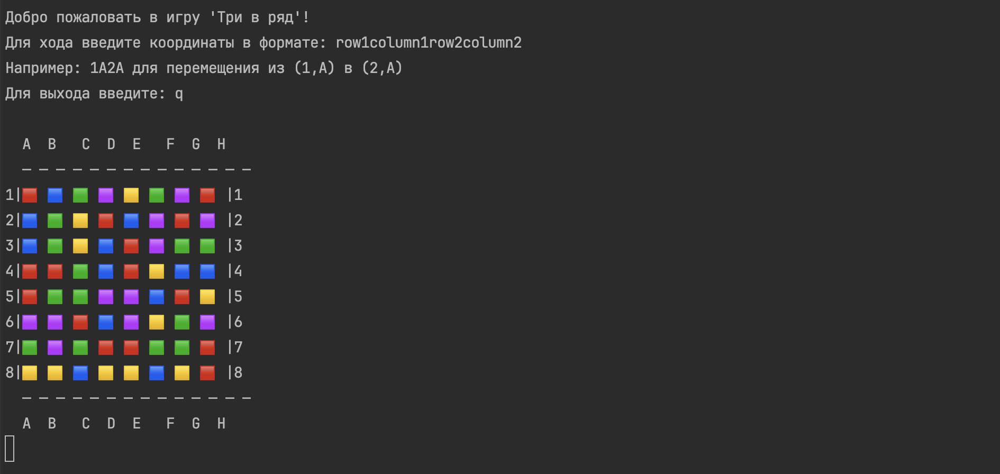
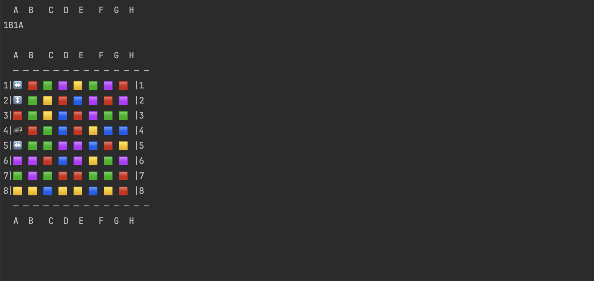
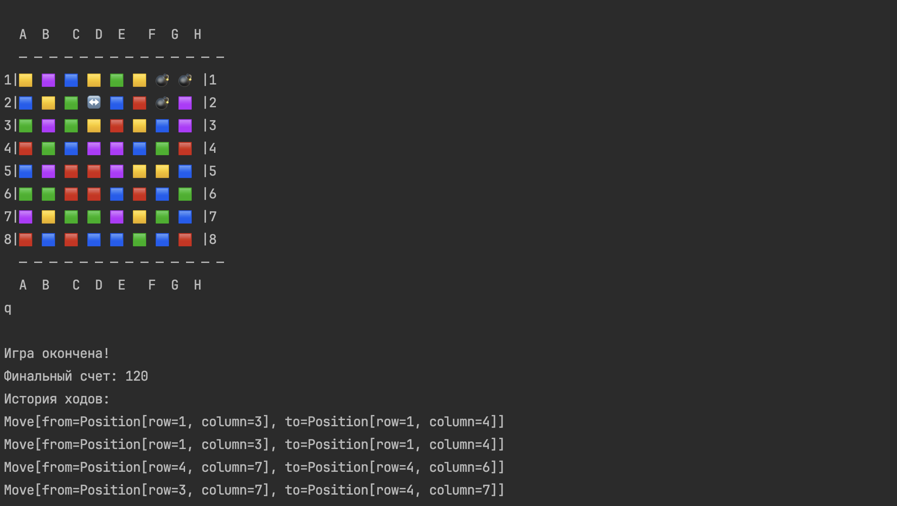

## **Игра "Три-в-ряд"**

Консольная реализация классической игры "Три-в-ряд" на Java, где игрок собирает комбинации из одинаковых элементов, 
перемещая соседние элементы на сетке 8x8.

- [Особенности](#особенности)
- [Запуск игры](#запуск-игры)
- [Управление](#управление)
- [Скриншоты](#скриншоты)

### **Особенности**

Стандартные элементы - 🟥, 🟨, 🟩, 🟦, 🟪.
Бонусные элементы - 💣, ↔️, ↕️.

### **Запуск игры**

1. Убедитесь, что установлена java и maven.
2. Запуск игры - необходимо в главной директории проекта выполнить команду:
```bash
mvn clean package && java -jar target/match-three-1.0-SNAPSHOT.jar
```

### **Управление**

Вводите пары координат для обмена элементов в формате:
``
1A2A
``
, где первая цифра - строка (1-8), буква - столбец (A-H). 


### **Скриншоты**


Пример начальной расстановки элементов



Пример игрового процесса



Пример финальной статистики после завершения игры

### **Требования**

Maven версии 3.9.11. 
Java версии 21.